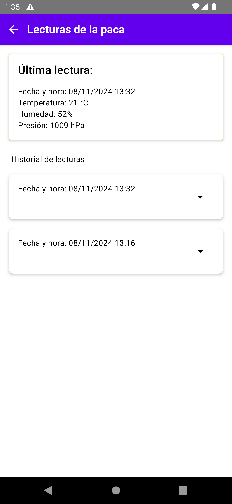

# EcoPaca-Analyzer

This is a Kotlin Multiplatform project targeting Android, iOS, and Desktop.

* `/composeApp` contains code that will be shared across your Compose Multiplatform applications.  
  It includes several subfolders:
  - `commonMain`: for code that’s common to all platforms.
  - Other folders are for Kotlin code that will be compiled only for the platform indicated in the folder name.  
    For example, if you want to use Apple’s CoreCrypto for the iOS part of your Kotlin app, `iosMain` would be the correct folder for such calls.

* `/iosApp` contains the iOS application. Even if you're sharing your UI with Compose Multiplatform, this entry point is required for your iOS app. This is also where you should add SwiftUI code for your project.

---

## Story

This project involves the creation of an IoT device based on an **ESP32** that will monitor the conditions of **biodigester bales**, such as **temperature** and **humidity**, and also track their **location** using a **GPS module**. The device will send the collected data to a cloud database via **Firebase**, enabling users to receive **alerts** and view the information in a **mobile app** developed with **Kotlin Multiplatform**.

The system is designed as an integrated monitoring tool, ensuring that the bales remain in optimal conditions while also allowing for location tracking when necessary, such as during transport or batch management.

## Mobile App Functionality

The mobile app provides an intuitive interface for visualizing and monitoring the data generated by the biodigester bales. The app integrates with Firebase to offer real-time access to critical information, including:

- **Temperature** and **Humidity**: Monitor the environmental conditions of each bale.
- **Location Tracking**: View the GPS location of the bales during transport or storage.
- **Real-Time Alerts**: Receive notifications if abnormal conditions arise, ensuring timely intervention.
- **Data History**: Access historical data for analysis and to track the conditions of the bales over time.

With this functionality, users can ensure that the bales remain in optimal conditions and track their status and location, improving the management and maintenance of the biodigesters.

# EcoPacaAnalyzer App Documentation

## Overview

The **EcoPacaAnalyzer** app is designed to monitor the environmental conditions of biodigester bales, such as temperature, humidity, and pressure, providing insights through a user-friendly interface. Users can view a list of bales, see readings associated with each bale, and access detailed information for each reading.

## Screens

### 1. Device List Screen

The Device List screen displays a list of bales registered in the system. Each bale represents a unit that monitors the environmental conditions of a specific biodigester bale.

**Features:**
- Displays a list of all available bales.
- Users can tap on a bale to view its readings.

**Screenshot:**

---

### 2. Readings Screen

The Readings Screen displays a list of readings associated with a specific bale. Each reading contains data such as timestamp, humidity, pressure, and temperature.

**Features:**
- Shows a list of readings for a selected bale.
- Users can tap on a specific reading to view detailed information.

**Screenshot:**

---

## Conclusion

These three screens form the core functionality of the EcoPacaAnalyzer app, enabling users to track and monitor the environmental conditions of biodigester bales. From viewing a list of bales to exploring individual readings in detail, the app helps users manage and ensure each bale's optimal condition.

Future enhancements could include real-time updates, data visualization, and more comprehensive analytics for bale data.

---

## Learn more about [Kotlin Multiplatform](https://www.jetbrains.com/help/kotlin-multiplatform-dev/get-started.html)